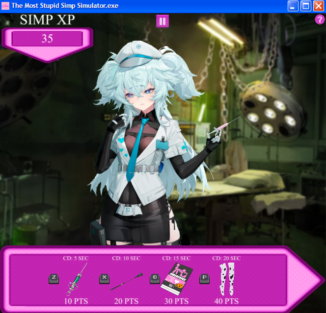

# <div align="center">The Most Stupid Simp Simulator</div>

## Support

You can (or not) support this game by buying me a coffee on [ko-fi](https://ko-fi.com/2dgirlenjoyer) or through merge requests

[](https://ko-fi.com/J3J210NM1B)


## Downloads

### GitHub Releases

Download the latest version for your platform:

- **AppImage** (Linux): [Download AppImage](https://github.com/yourusername/the-most-stupid-simp-simulator/releases)
- **Flatpak** (Linux): [Download Flatpak](https://github.com/yourusername/the-most-stupid-simp-simulator/releases)
- **Squirrel** (Windows): [Download Squirrel Installer](https://github.com/yourusername/the-most-stupid-simp-simulator/releases)


## Introduction
<div style="text-align: center;">
  
</div>


Give headpats and gifts to the one you love, and simp without limits to break records and become the strongest simp to ever exist.


**Folow updates on my ko-fi page and X/Twitter: 

[Ko-fi](https://ko-fi.com/2dgirlenjoyer)

[X/Twitter](https://x.com/weeb_head_yabai)


## Build Yourself

### Prerequisites

#### General Requirements
- Node.js (v16 or higher)
- npm or yarn
- Git

#### Platform-Specific Requirements

**For Flatpak builds (Linux):**
- `flatpak` installed on your system
- `flatpak-builder` installed on your system
- `eu-strip` (usually part of the `elfutils` package)
- Flathub remote repository added:
  ```bash
  flatpak remote-add --if-not-exists --user flathub https://dl.flathub.org/repo/flathub.flatpakrepo
  ```

**For AppImage builds (Linux):**
- Linux system (any modern distribution)
- `wget` command-line tool (for downloading appimagetool)
- `fuse` or `fuse2` package (required for appimagetool to run during build process)

**For Squirrel builds (Windows):**
- Windows system or cross-compilation setup

### Setup

1. Clone the repository:
```bash
git clone https://github.com/2D-girls-enjoyer/The-Most-Stupid-Simp-Simulator.git
cd the-most-stupid-simp-simulator
```

2. Install dependencies:
```bash
npm install
```

### Building for Different Platforms

#### Squirrel (Windows)

For 64-bit:
```bash
npm run win-make-squirrel
```

For 32-bit:
```bash
npm run win-make32-squirrel
```

#### AppImage (Linux)

For 64-bit:
```bash
npm run linux-make-appimage
```

For 32-bit:
```bash
npm run linux-make32-appimage
```

#### Flatpak (Linux)

For 64-bit:
```bash
npm run linux-make-flatpak
```

For 32-bit:
```bash
npm run linux-make32-flatpak
```
